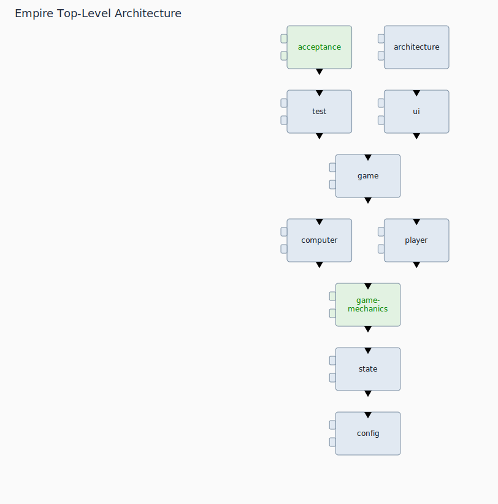

# architecture-viewer

Clojure tool for visualizing a project's architecture as layered namespaces with dependency indicators.



## Dependency Discovery

- The tool scans source files under the configured source paths (default `src`) inside `--project-path`.
- It reads each file’s `ns` form and extracts `:require` dependencies between project namespaces.
- From those `from -> to` relationships, it builds a namespace dependency graph.
- It also records source-file paths per namespace and marks polymorphic namespaces (`defprotocol`, `defmulti`, `definterface`) as abstract.

## Layer Rationale

- Layers give a top-to-bottom architecture view: high-level namespaces at the top, source-code modules (leaf namespaces/files) at the bottom.
- Before ranking, cycles are identified and the offending dependencies are removed so the remaining graph is acyclic.
- A topological ordering of that acyclic graph determines vertical levels.
- Namespaces at the same level are peers and are placed side by side.
- Offending cyclic dependencies are still shown as indicators so cycle information remains visible.

## Visual Legend

- High-level namespaces are rectangles with two protruding nubs on the left.
  They are usually light blue, and green if they contain an abstract module.
- Leaf namespaces are rectangles without nubs.
  They have a thick black border.
- Namespace names are dark by default.
  <span style="color:red">They are red when that namespace subtree contains a cycle.</span>
- A small triangle centered on the top edge means incoming dependencies.
  A small triangle centered on the bottom edge means outgoing dependencies.
- Triangles are black by default.
  <span style="color:red">They turn red when any dependency in that direction is part of a cycle.</span>
- Hovering over a triangle opens a popup list of dependency paths.
  <span style="color:red">Paths omit the top-level namespace, cycle entries are red, and long popup lists can be scrolled with the mouse wheel.</span>
- When the current view contains cycles, they are listed at the bottom of the diagram in `a->b->c->a` form.
  Multiple cycles are shown as a list.

## Navigation

- Click a non-leaf namespace name to drill down into that namespace.
- Drilling down replaces the scene with that namespace as the new root.
- Click a leaf/source namespace to open its source code viewer.
- Click `Back: <name>` in the toolbar to move back up one level.
- Back restores the previous namespace path and scroll position.
- Click `Reanalyze` in the toolbar to rescan the target project and redraw the current view.
  This button is available for `--project-path` sessions and is intentionally hidden for `--in-edn` sessions.
- The viewer window is resizable.
  When the window grows, the diagram is rebuilt and recentered horizontally.
- Vertical and horizontal scrollbars appear when the diagram or cycle list exceeds the viewport.

## Use From Another Project

The preferred `deps.edn` alias for a consuming project is a dedicated `:arch-view` alias that adds this repo as a git dependency and points `main-opts` at `arch-view.core`:

```clojure
:arch-view
{:replace-deps
 {io.github.unclebob/arch-view
  {:git/url "https://github.com/unclebob/arch-view.git"
   :git/sha "2d835136a816c3f6174c90ae10be12c6dc99e1d3"}}
 :main-opts ["-m" "arch-view.core"]}
```

Then run the viewer from that project with:

```bash
clj -M:arch-view --project-path .
```

Using `:replace-deps` keeps the viewer isolated from the target project's runtime dependency set, which avoids unrelated classpath/version conflicts.

## Run

Print CLI usage:

```bash
clj -M:run --help
```

Export architecture data to EDN (headless):

```bash
clj -M:run --project-path /path/to/project --no-gui --out /tmp/architecture.edn
```

Open the interactive viewer:

```bash
clj -M:run --project-path /path/to/project
```

If `--project-path` is omitted, the tool uses the current directory (`.`).
Use `--no-gui` if you only want the EDN output and not the interactive window.
